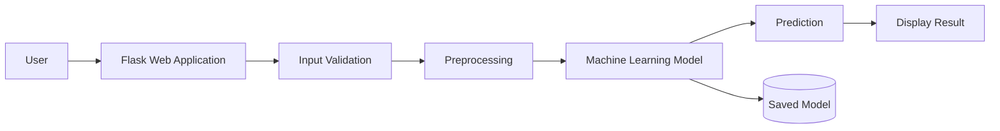

# System Architecture

## Overview

The HDI Prediction System follows a layered architecture consisting of User Interface, Flask Application, Machine Learning Model, and Dataset.

## Components

### User Interface
Accepts socio-economic indicators from users.

### Flask Backend
Processes requests and communicates with the ML model.

### Machine Learning Model
Predicts the HDI category using trained data.

### Dataset
Provides historical HDI data used for training.