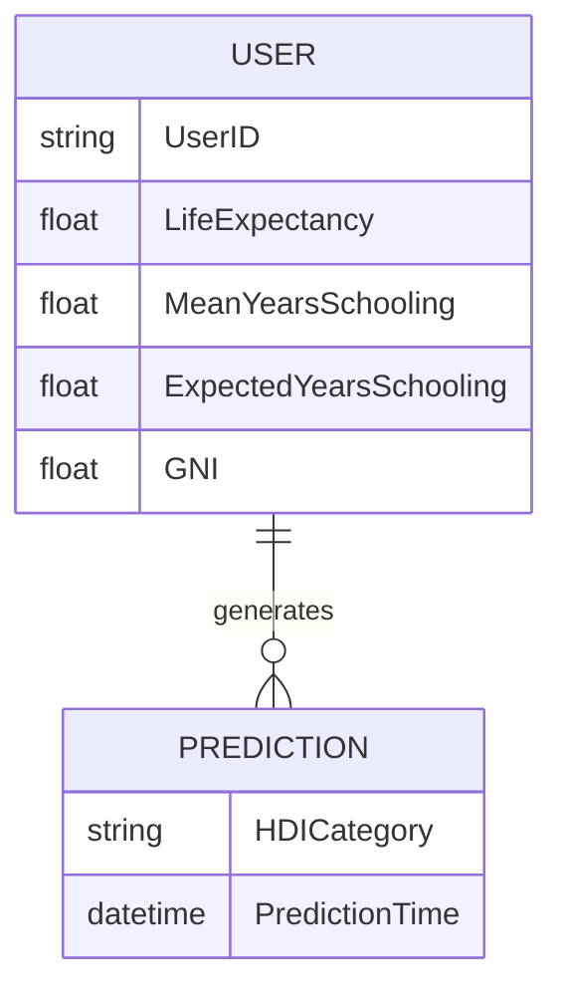

# Entity Relationship Diagram

```mermaid
erDiagram

USER ||--o{ PREDICTION : generates

USER {
string UserID
float LifeExpectancy
float MeanYearsSchooling
float ExpectedYearsSchooling
float GNI
}

PREDICTION {
string HDICategory
datetime PredictionTime
}
```

## Description

The user provides socio-economic indicators, and the system generates a corresponding HDI prediction.