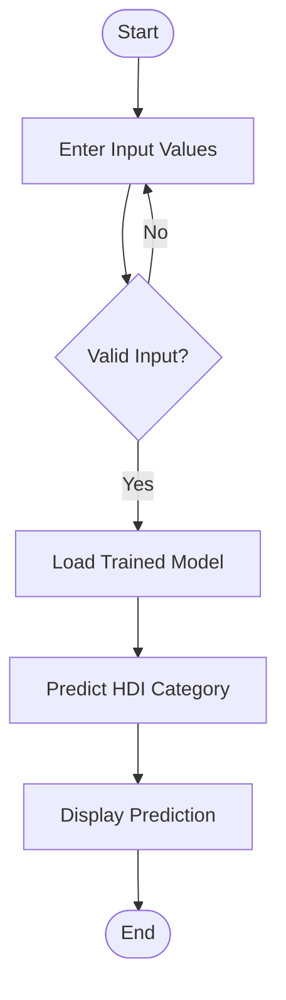

# Flowchart

```mermaid
flowchart TD

A([Start])

A --> B[Enter Input Values]

B --> C{Valid Input?}

C -- No --> B

C -- Yes --> D[Load Trained Model]

D --> E[Predict HDI Category]

E --> F[Display Prediction]

F --> G([End])
```