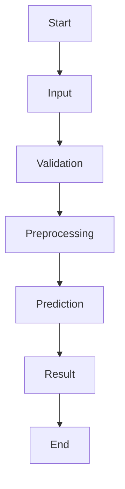

# Workflow Diagram

## Workflow Description

1. User enters development indicators.
2. System validates the inputs.
3. Data is preprocessed.
4. Trained model predicts the HDI category.
5. Prediction is displayed.